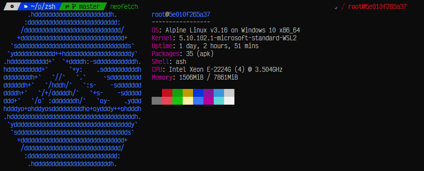

# Oh-My-ZSH Custom Installer 

## INSTALL

```bash
sh -c "$(curl -fsSL https://raw.github.com/nhahv/oh-my-zsh-installer/main/install.sh)"
```

## INFO

### Multiple OS Support

- [x] Debian: 9-stretch, 10-buster, 11-bullseye
- [x] Ubuntu: 18.04, 20.04, 22.04 ...
- [x] Centos: 7, 8
- [x] AmazonLinux: 2
- [x] Alpine: 3.14, 3.15, 3.16

### Plugins
- [x] zsh-autosuggestions (https://github.com/zsh-users/zsh-autosuggestions.git)
- [x] zsh-syntax-highlighting (https://github.com/zsh-users/zsh-syntax-highlighting.git)
- [x] powerlevel10k (https://github.com/romkatv/powerlevel10k.git)
- [x] git extract copypath copyfile copybuffer dirhistory

### Themes
- Powerlevel10k (Unicode, Compact, Rainbow, Slanted)
  
